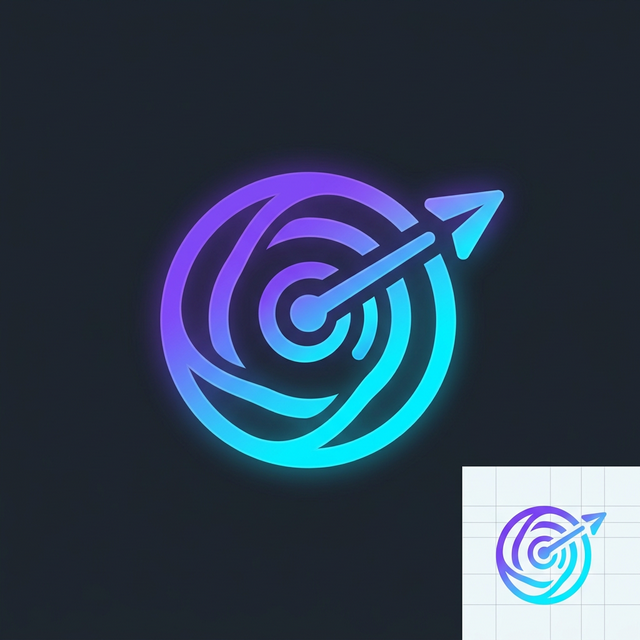

# <p align="center"></p>

<h1 align="center">OmniPost</h1>


## 🚀 Broadcast Everywhere, Manage Once

`OmniPost` 是一个现代化的全能内容发布工具，旨在帮助内容创作者和运营者高效地将视频内容一键发布到多个主流社交媒体平台。项目实现了对 `抖音`、`小红书`、`快手`、`视频号` 等平台的视频上传、定时发布等功能。

## 目录

- [📋 项目概述](#-项目概述)
- [💡 功能特性](#-功能特性)
- [🔧 技术栈](#-技术栈)
- [🚀 支持的平台](#-支持的平台)
- [💾 安装指南](#-安装指南)
- [🏁 快速开始](#-快速开始)
- [📁 项目结构](#-项目结构)
- [🤝 贡献指南](#-贡献指南)
- [🙏 致谢](#-致谢)
- [📜 许可证](#-许可证)

## 📋 项目概述

`OmniPost` 是一个开源的全平台内容发布工具，支持多种主流平台的视频发布自动化。该项目采用 **Monorepo 架构**，提供了专业的 Web 界面和 RESTful API 接口，同时保留了灵活的 CLI 使用方式，并配备完善的测试体系。

主要应用场景：
- 内容创作者批量发布视频到多个平台
- 运营团队管理多账号定时发布任务
- 自动化工作流集成

## 💡 功能特性

- ✅ **多平台支持**：覆盖国内主流社交媒体平台
- ✅ **文章发布**：支持 Markdown 发布到知乎、掘金（新！）
- ✅ **浏览器会话复用**：直接复用本地 Chrome 会话，实现无感登录（新！）
- ✅ **统一 CLI**：为开发者提供的强大命令行工具（新！）
- ✅ **定时发布**：支持设置精确发布时间
- ✅ **前后端分离**：提供直观的 Web 管理界面
- ✅ **API 封装**：支持与其他系统集成
- ✅ **Cookie 管理**：支持多账号 Cookie 存储与管理
- ✅ **完善的测试**：全面的自动化测试保障稳定性
- ✅ **自动化 CI/CD**：集成 GitHub Actions 持续集成流程

### 平台支持状态

| 平台 | 状态 |
|------|------|
| 抖音 | ✅ |
| 视频号 | ✅ |
| 小红书 | ✅ |
| 快手 | ✅ |

## 🔧 技术栈

### 后端选项 (双端支持)

#### 1. Python 后端 (默认/稳定)
- **语言**: Python 3.10
- **框架**: Flask (异步支持)
- **浏览器自动化**: Playwright
- **数据库**: SQLite
- **测试框架**: pytest + pytest-asyncio

#### 2. Node.js 后端 (现代化 TypeScript)
- **语言**: Node.js 20+ (TypeScript 5.x)
- **框架**: Express.js (ESM)
- **浏览器自动化**: Playwright (Node.js 版)
- **数据库**: SQLite (与 Python 共用)
- **测试框架**: Vitest

### 前端
- **框架**: Vue 3 + Vite
- **UI 组件库**: Element Plus
- **状态管理**: Pinia
- **路由**: Vue Router
- **HTTP 客户端**: Axios

## 🚀 支持的平台

本项目通过各平台对应的 `uploader` 模块实现视频上传功能：

| 平台名称 | 上传器模块 |
|---------|------------|
| 抖音 | `src/uploader/douyin_uploader/main.py` |
| 视频号 | `src/uploader/tencent_uploader/main.py` |
| 小红书 | `src/uploader/xiaohongshu_uploader/main.py` |
| 快手 | `src/uploader/ks_uploader/main.py` |

## 💾 安装指南

### 环境要求

- Node.js >= 18.0.0
- Python 3.10.x
- npm >= 9.0.0

### 1. 克隆项目

```bash
git clone https://github.com/RbBtSn0w/omni-post.git
cd omni-post
```

### 2. 安装依赖

```bash
# 一键安装（Node 工作空间 + 可选 Python 依赖）
npm run setup

# 仅安装 Node 工作空间依赖
npm run install:ws

# 安装 Python 后端依赖（可选）
npm run install:python
```

### 2.1 工作空间命令

```bash
# 对所有工作空间执行 lint/test
npm run lint
npm run test

# 清理工作空间产物
npm run clean

# 校验工作空间契约
npm run check:workspace

# 测量安装耗时（SC-001 基线）
time npm install
```

### 3. 安装 Playwright 浏览器驱动

```bash
# Python 后端
cd apps/backend
.venv/bin/python -m playwright install chromium

# Node.js 后端
npx playwright install chromium
```

### 4. 初始化数据库

```bash
cd apps/backend
.venv/bin/python src/db/createTable.py
```

### 5. 启动服务

```bash
# 选项 A：启动 Python 后端 (遗留)
npm run dev:backend

# 选项 B：启动 Node.js TypeScript 后端
npm run dev:node & npm run dev:frontend

# 或者分别启动
npm run dev:node       # Node.js 后端 (http://localhost:5409)
npm run dev:frontend   # 前端服务 (http://localhost:5173)
```

## 🏁 快速开始

1. 启动服务后，访问 `http://localhost:5173`
2. 在 Web 界面中添加账号并登录
3. 上传视频文件并填写标题、标签等信息
4. 选择发布平台和发布时间
5. 点击发布，系统将自动执行发布任务

## 📁 项目结构

```
omni-post/
├── apps/
│   ├── backend/                 # Python Flask 后端 (核心)
│   │   ├── src/
│   │   │   ├── app.py          # 应用入口
│   │   │   ├── core/           # 配置与日志
│   │   │   ├── routes/         # API 路由
│   │   │   ├── services/       # 业务逻辑
│   │   │   └── uploader/       # 视频上传驱动
│   │   └── tests/              # Pytest 测试集
│   │
│   ├── backend-node/            # Node.js TypeScript 后端 (新)
│   │   ├── src/
│   │   │   ├── app.ts          # Express 应用
│   │   │   ├── routes/         # 1:1 API 兼容路由
│   │   │   ├── services/       # 业务逻辑与执行器
│   │   │   └── uploader/       # TS 版上传驱动
│   │   └── tests/              # Vitest 测试集
│   │
│   └── frontend/               # Vue.js 前端 (共用)
│       ├── src/
│       │   ├── views/          # 页面组件 (Dashboard, PublishCenter 等)
│       │   ├── components/     # 公共组件
│       │   ├── stores/         # Pinia 状态管理
│       │   ├── api/            # API 调用层
│       │   └── router/         # 路由配置
│       └── tests/              # 前端测试
│
├── package.json                # Monorepo 根配置
├── ARCHITECTURE.md             # 架构文档
└── CONTRIBUTING.md             # 贡献指南
```

## 🤝 贡献指南

欢迎各种形式的贡献！详细信息请参阅 [CONTRIBUTING.md](CONTRIBUTING.md)。

### 贡献流程

1. Fork 本仓库
2. 创建分支 (`git checkout -b feature/YourFeature`)
3. 提交更改 (`git commit -m 'Add some feature'`)
4. Push 到分支 (`git push origin feature/YourFeature`)
5. 创建 Pull Request

### 开发规范

- 后端：遵循 PEP 8 编码规范
- 前端：遵循 Vue 3 最佳实践
- 运行测试：`npm test`

## 🙏 致谢

本项目受 [dreammis/social-auto-upload](https://github.com/dreammis/social-auto-upload) 启发，在其基础上进行了完全重构。感谢原项目团队的开创性工作！

## 📜 许可证

本项目采用 [MIT License](LICENSE) 开源许可证。

---

> 如果这个项目对您有帮助，请给一个 ⭐ Star 以表示支持！
