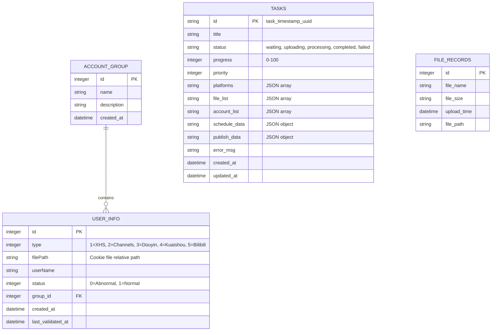

# 数据模型设计 (Data Model)

## 概述

本项目由于要求与 Python 后端的 SQLite 数据完全一致且可以共用同一个 `data/data.db` 文件，因此采用一致的表结构定义，并在 Node.js 侧补齐强类型的 TypeScript 接口定义 (`interfaces`)，解决 Python 中动态字典的问题。

## 实体关系图



## TypeScript 接口定义 (最佳实践补充)

在 `src/db/models.ts` 或类似文件中，应统一定义以下强类型接口，以取代 Python 中的字典读取：

### 1. `UserInfo` (账号表)
```typescript
export interface UserInfo {
  id: number;
  type: PlatformType; // 枚举：1|2|3|4|5
  filePath: string;
  userName: string;
  status: number; // 0 | 1
  group_id: number | null;
  created_at: string;
  last_validated_at: string | null;
}
```

### 2. `Task` (任务表)
```typescript
export interface TaskRecord {
  id: string;
  title: string | null;
  status: 'waiting' | 'uploading' | 'processing' | 'completed' | 'failed';
  progress: number;
  priority: number;
  platforms: string; // JSON String -> PlatformType[]
  file_list: string; // JSON String -> string[]
  account_list: string; // JSON String -> string[]
  schedule_data: string | null; // JSON String -> ScheduleData
  publish_data: string | null; // JSON String -> any
  error_msg: string | null;
  created_at: string;
  updated_at: string | null;
}

// 反序列化后的领域对象
export interface Task {
  id: string;
  title: string | null;
  status: string;
  progress: number;
  priority: number;
  platforms: PlatformType[];
  fileList: string[];
  accountList: string[];
  scheduleData: ScheduleData | null;
  publishData: Record<string, any> | null;
  errorMsg: string | null;
  createdAt: string;
  updatedAt: string | null;
}
```

### 3. `UploadOptions` (发布参数服务间传递模型)
```typescript
export interface UploadOptions {
    title: string;
    fileList: string[];
    tags: string[];
    accountList: string[];
    category?: number | null;
    enableTimer?: boolean;
    videosPerDay?: number;
    dailyTimes?: number[];
    startDays?: number;
    thumbnailPath?: string;
    productLink?: string;
    productTitle?: string;
    isDraft?: boolean;
    publishDatetimes?: (Date | number | 0)[];
}
```

## 存储约定
- 数据库路径: `apps/backend-node/data/data.db` (通过全局配置解析绝对路径)
- 视频文件存储: `apps/backend-node/data/videos/`
- Cookie 存储: `apps/backend-node/data/cookies/` (排除在 git 之外)
