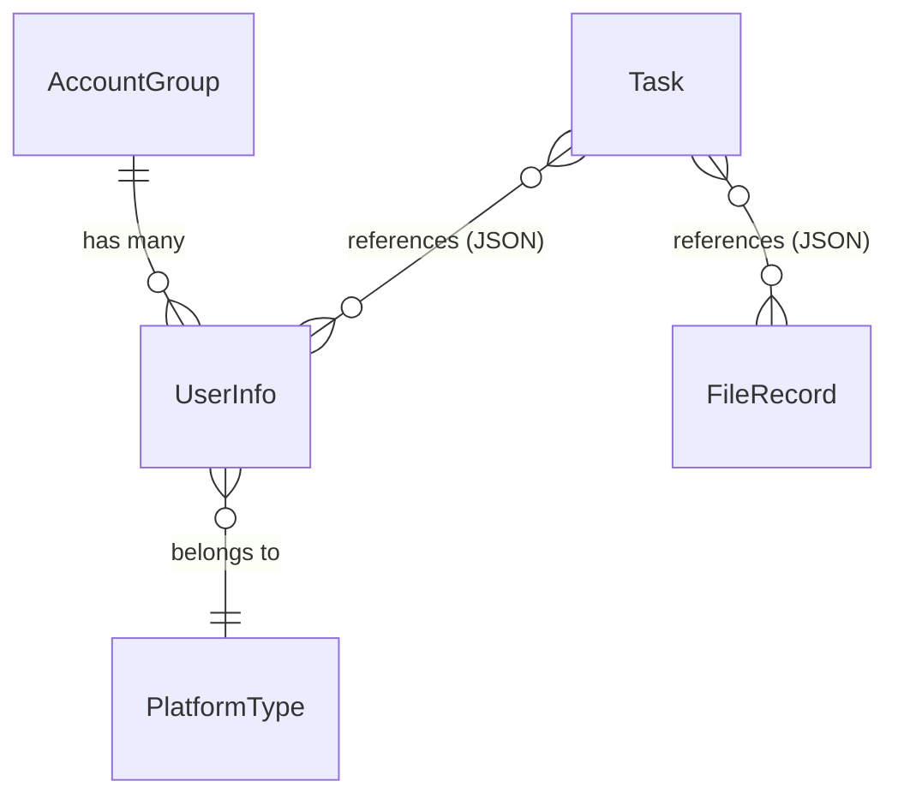

# Data Model: Node.js TypeScript 后端重写

**Branch**: `024-node-backend-rewrite` | **Date**: 2026-03-07

> 数据模型与 Python 后端完全一致，使用相同的 SQLite schema。

## 实体定义

### 1. AccountGroup (账号组)

| 字段 | 类型 | 约束 | 说明 |
|------|------|------|------|
| id | INTEGER | PK, AUTOINCREMENT | 自增主键 |
| name | TEXT | NOT NULL, UNIQUE | 组名称 |
| description | TEXT | 可选 | 组描述 |
| created_at | DATETIME | DEFAULT CURRENT_TIMESTAMP | 创建时间 |
| updated_at | DATETIME | DEFAULT CURRENT_TIMESTAMP | 更新时间 |

### 2. UserInfo (账号)

| 字段 | 类型 | 约束 | 说明 |
|------|------|------|------|
| id | INTEGER | PK, AUTOINCREMENT | 自增主键 |
| type | INTEGER | NOT NULL | 平台类型 (1-5) |
| filePath | TEXT | NOT NULL | Cookie 文件路径 |
| userName | TEXT | NOT NULL | 用户名 |
| status | INTEGER | DEFAULT 0 | 账号状态 (0=未验证, 1=正常) |
| group_id | INTEGER | FK → account_groups(id) | 所属组 |
| created_at | DATETIME | DEFAULT CURRENT_TIMESTAMP | 创建时间 |
| last_validated_at | DATETIME | DEFAULT CURRENT_TIMESTAMP | 最近验证时间 |

**约束**: `UNIQUE(type, userName)` — 每个平台每个用户名唯一

### 3. FileRecord (文件记录)

| 字段 | 类型 | 约束 | 说明 |
|------|------|------|------|
| id | INTEGER | PK, AUTOINCREMENT | 自增主键 |
| filename | TEXT | NOT NULL | 文件名 |
| filesize | REAL | 可选 | 文件大小 (MB) |
| upload_time | DATETIME | DEFAULT CURRENT_TIMESTAMP | 上传时间 |
| file_path | TEXT | 可选 | 存储路径 (uuid_filename) |

### 4. Task (任务)

| 字段 | 类型 | 约束 | 说明 |
|------|------|------|------|
| id | TEXT | PK | 任务ID (task_{timestamp}_{uuid8}) |
| title | TEXT | 可选 | 任务标题 |
| status | TEXT | DEFAULT 'waiting' | 状态 |
| progress | REAL | DEFAULT 0 | 进度 (0-100) |
| priority | INTEGER | DEFAULT 1 | 优先级 |
| platforms | TEXT | JSON | 平台列表 [1,2,3...] |
| file_list | TEXT | JSON | 文件列表 |
| account_list | TEXT | JSON | 账号列表 |
| schedule_data | TEXT | JSON | 调度数据 |
| error_msg | TEXT | 可选 | 错误信息 |
| publish_data | TEXT | JSON | 原始请求数据 |
| created_at | DATETIME | DEFAULT CURRENT_TIMESTAMP | 创建时间 |
| updated_at | DATETIME | DEFAULT CURRENT_TIMESTAMP | 更新时间 |

**状态流转**: `waiting` → `uploading` → `processing` → `completed` / `failed`

## 实体关系

## 平台类型枚举

| 值 | 平台 | 中文名 | 登录 URL |
|----|------|--------|----------|
| 1 | XIAOHONGSHU | 小红书 | https://creator.xiaohongshu.com/ |
| 2 | TENCENT | 视频号 | https://channels.weixin.qq.com |
| 3 | DOUYIN | 抖音 | https://creator.douyin.com/ |
| 4 | KUAISHOU | 快手 | https://cp.kuaishou.com |
| 5 | BILIBILI | Bilibili | https://member.bilibili.com/platform/home |
