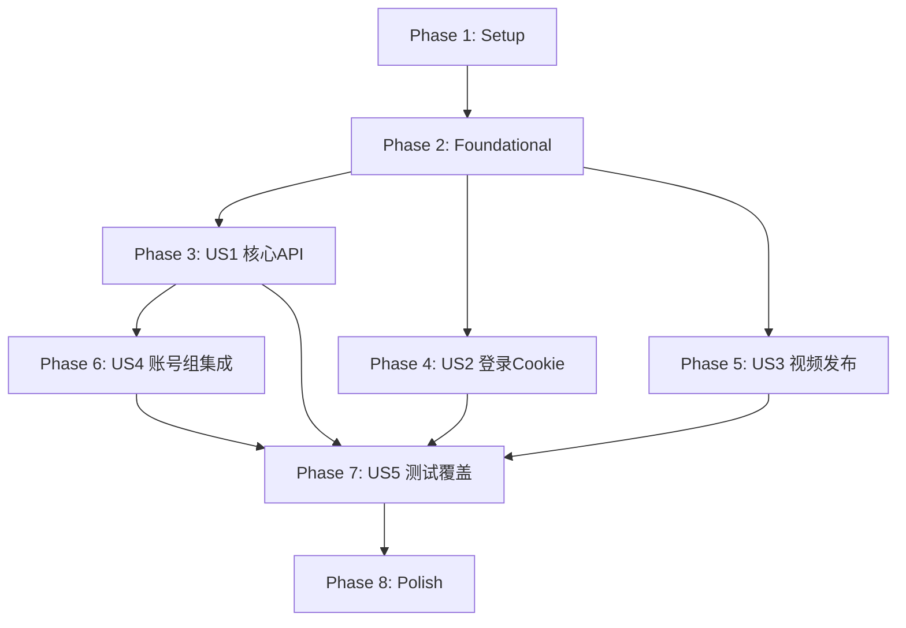

# Tasks: Node.js TypeScript 后端重写

**Input**: Design documents from `/specs/024-node-backend-rewrite/`
**Prerequisites**: plan.md ✅, spec.md ✅, research.md ✅, data-model.md ✅, contracts/ ✅, quickstart.md ✅

**Tests**: ✅ 测试在规格中明确要求（US5 / FR-014），因此包含测试任务。

**Organization**: 任务按用户故事分组，支持独立实施和测试。

## Format: `[ID] [P?] [Story] Description`

- **[P]**: 可并行执行（不同文件，无依赖）
- **[Story]**: 任务所属用户故事（US1~US5）
- 包含准确的文件路径

## Path Conventions

- **新后端**: `apps/backend-node/src/`, `apps/backend-node/tests/`
- **上传器**: `apps/backend-node/src/uploader/<platform>/main.ts`
- **Python 参照**: `apps/backend/src/`, `apps/backend/tests/`

---

## Phase 1: Setup (项目初始化)

**Purpose**: 创建 `apps/backend-node/` 项目基础结构

- [ ] T001 初始化 `apps/backend-node/package.json`（name, scripts: dev/build/test/db:init, dependencies: express, better-sqlite3, playwright, multer, cors, winston, uuid; devDependencies: typescript, tsx, vitest, @types/*）
- [ ] T002 创建 `apps/backend-node/tsconfig.json`（target: ES2022, module: ESNext, moduleResolution: bundler, strict: true, outDir: dist, rootDir: src）
- [ ] T003 [P] 创建 `apps/backend-node/vitest.config.ts`（根据 quickstart.md 配置 test root、coverage）
- [ ] T004 [P] 创建 `apps/backend-node/.gitignore`（node_modules, dist, data/, *.db）
- [ ] T005 运行 `npm install` 安装依赖并运行 `npx playwright install chromium`

---

## Phase 2: Foundational (基础设施 — 阻塞所有用户故事)

**Purpose**: 核心基础设施，所有用户故事都依赖此阶段完成

**⚠️ CRITICAL**: 用户故事实施前必须完成本阶段

- [ ] T006 [P] 实现 `apps/backend-node/src/core/config.ts` — 目录路径（BASE_DIR, ROOT_DIR, DATA_DIR, COOKIES_DIR, VIDEOS_DIR, LOGS_DIR）、服务器配置（HOST, PORT=5409）、上传限制（500MB）、Chrome 路径、调试模式。对标 `apps/backend/src/core/config.py`
- [ ] T007 [P] 实现 `apps/backend-node/src/core/constants.ts` — PlatformType 枚举（1-5）、TencentZoneTypes、VideoZoneTypes、PLATFORM_NAMES、PLATFORM_LOGIN_URLS、getPlatformName()、getPlatformType()、isValidPlatform()。对标 `apps/backend/src/core/constants.py`
- [ ] T008 [P] 实现 `apps/backend-node/src/core/logger.ts` — 使用 winston 创建业务日志器（douyin, tencent, xhs, bilibili, kuaishou, xiaohongshu），支持控制台彩色输出和文件轮转（10MB/10天）。对标 `apps/backend/src/core/logger.py`
- [ ] T009 [P] 实现 `apps/backend-node/src/utils/files-times.ts` — generateScheduleTimeNextDay() 函数，与 Python 版 generate_schedule_time_next_day() 逻辑完全一致。对标 `apps/backend/src/utils/files_times.py`
- [ ] T010 [P] 实现 `apps/backend-node/src/utils/network.ts` — asyncRetry() 高阶函数（timeout + maxRetries 参数），替代 Python 的 async_retry 装饰器。对标 `apps/backend/src/utils/network.py`
- [ ] T011 [P] 复制 `apps/backend/src/utils/stealth.min.js` 到 `apps/backend-node/src/utils/stealth.min.js`
- [ ] T012 实现 `apps/backend-node/src/core/browser.ts` — launchBrowser()、setInitScript()（加载 stealth.min.js）、createScreenshotDir()、debugScreenshot()、debugPrint()。对标 `apps/backend/src/core/browser.py`
- [ ] T013 实现 `apps/backend-node/src/db/database.ts` — DatabaseManager 类（getDbPath(), getDataDir()），使用 better-sqlite3。对标 `apps/backend/src/db/db_manager.py`
- [ ] T014 实现 `apps/backend-node/src/db/migrations.ts` — 创建4张表（account_groups, user_info, file_records, tasks），SQL 语句与 Python 版完全一致。对标 `apps/backend/src/db/createTable.py`
- [ ] T015 实现 `apps/backend-node/src/services/task-service.ts` — TaskService 类（createTask, updateTaskStatus, getAllTasks, deleteTask），JSON 序列化/反序列化逻辑与 Python 版一致。对标 `apps/backend/src/services/task_service.py`
- [ ] T016 实现 `apps/backend-node/src/app.ts` — Express 应用工厂（CORS 配置、上传大小限制、路由注册、静态文件服务 /assets, /favicon.ico, /vite.svg, /）。对标 `apps/backend/src/app.py`
- [ ] T017 实现 `apps/backend-node/src/index.ts` — 服务器入口（启动 Express，监听 0.0.0.0:5409）

**Checkpoint**: 基础设施就绪 — 可以开始用户故事实施

---

## Phase 3: User Story 1 — 核心 API 服务功能等价 (Priority: P1) 🎯 MVP

**Goal**: 新后端提供与 Python 后端完全相同的 REST API 接口，前端无需修改即可使用

**Independent Test**: 前端 API 地址切换到新后端，验证仪表盘、文件管理、账号管理所有页面功能正常

### Implementation for User Story 1

- [ ] T018 [P] [US1] 实现 `apps/backend-node/src/routes/dashboard.ts` — GET /getDashboardStats 端点，查询4张表统计数据（accountStats, platformStats, taskStats, contentStats, taskTrend, recentTasks）。对标 `apps/backend/src/routes/dashboard.py`
- [ ] T019 [P] [US1] 实现 `apps/backend-node/src/routes/file.ts` — 5个端点：POST /upload, GET /getFile, POST /uploadSave, GET /getFiles, GET /deleteFile。使用 multer 处理文件上传。对标 `apps/backend/src/routes/file.py`
- [ ] T020 [P] [US1] 实现 `apps/backend-node/src/routes/account.ts` — 5个端点：GET /getAccounts, GET /getValidAccounts, GET /getAccountStatus, GET /deleteAccount, POST /updateUserinfo。对标 `apps/backend/src/routes/account.py`
- [ ] T021 [P] [US1] 实现 `apps/backend-node/src/routes/cookie.ts` — 2个端点：POST /uploadCookie, GET /downloadCookie。对标 `apps/backend/src/routes/cookie.py`
- [ ] T022 [P] [US1] 实现 `apps/backend-node/src/routes/group.ts` — 5个端点：GET /getGroups, POST /createGroup, PUT /updateGroup/:groupId, DELETE /deleteGroup/:groupId, GET /getGroupAccounts/:groupId。对标 `apps/backend/src/routes/group.py`
- [ ] T023 [US1] 在 `apps/backend-node/src/app.ts` 中注册 US1 所有路由（dashboard, file, account, cookie, group），添加 /api 前缀
- [ ] T024 [US1] 端到端验证：启动新后端，使用前端访问仪表盘页面、素材管理页面、账号管理页面，确认数据正确

**Checkpoint**: 前端可连接新后端使用仪表盘、文件、账号和组管理功能

---

## Phase 4: User Story 2 — 平台自动化登录与 Cookie 管理 (Priority: P1)

**Goal**: 通过 Playwright 完成各平台登录流程，正确管理 Cookie 存储和验证

**Independent Test**: 前端发起 SSE 登录请求，观察事件流格式和 Cookie 文件保存

### Implementation for User Story 2

- [ ] T025 [P] [US2] 实现 `apps/backend-node/src/services/auth-service.ts` — AuthService 接口 + DefaultAuthService（5个平台的 cookie 认证方法委托到 CookieService）。对标 `apps/backend/src/services/auth_service.py`
- [ ] T026 [P] [US2] 实现 `apps/backend-node/src/services/cookie-service.ts` — CookieService 接口 + DefaultCookieService（cookieAuthDouyin, cookieAuthTencent, cookieAuthKs, cookieAuthXhs, cookieAuthBilibili, checkCookie），使用 Playwright 验证 cookie 有效性。对标 `apps/backend/src/services/cookie_service.py`
- [ ] T027 [US2] 实现 `apps/backend-node/src/services/login-service.ts` — LoginService 抽象类 + MockLoginService + DefaultLoginService + sseStream() + runAsyncFunction() + activeQueues 全局变量。对标 `apps/backend/src/services/login_service.py`
- [ ] T028 [US2] 实现 `apps/backend-node/src/services/login-impl.ts` — 5个平台的具体登录逻辑（douyinCookieGen, getTencentCookie, getKsCookie, xiaohongshuCookieGen, bilibiliCookieGen）。对标 `apps/backend/src/services/login_impl.py`
- [ ] T029 [US2] 实现 `apps/backend-node/src/routes/publish.ts` 中的 SSE 登录端点 — GET /login?type=&id=&group=，返回 text/event-stream，启动登录线程。对标 `apps/backend/src/routes/publish.py` login()
- [ ] T030 [US2] 在 account 路由中集成 CookieService 验证逻辑（getValidAccounts 和 getAccountStatus 端点需要调用 cookie 验证）

**Checkpoint**: 登录 SSE 流正常工作，Cookie 文件可正确保存和验证

---

## Phase 5: User Story 3 — 多平台视频发布 (Priority: P1)

**Goal**: 通过 Playwright 自动化向5个平台发布视频，支持定时和批量

**Independent Test**: 创建发布任务并监控任务状态变化（waiting → uploading → completed/failed）

### Implementation for User Story 3

- [ ] T031 [P] [US3] 实现 `apps/backend-node/src/uploader/douyin/main.ts` — DouyinVideo 类（upload 方法），使用 Playwright 自动化抖音视频上传。对标 `apps/backend/src/uploader/douyin_uploader/main.py`
- [ ] T032 [P] [US3] 实现 `apps/backend-node/src/uploader/tencent/main.ts` — TencentVideo 类（upload 方法），使用 Playwright 自动化视频号上传。对标 `apps/backend/src/uploader/tencent_uploader/main.py`
- [ ] T033 [P] [US3] 实现 `apps/backend-node/src/uploader/xiaohongshu/main.ts` — XiaoHongShuVideo 类（upload 方法）。对标 `apps/backend/src/uploader/xiaohongshu_uploader/main.py`
- [ ] T034 [P] [US3] 实现 `apps/backend-node/src/uploader/kuaishou/main.ts` — KuaishouVideo 类（upload 方法）。对标 `apps/backend/src/uploader/ks_uploader/main.py`
- [ ] T035 [P] [US3] 实现 `apps/backend-node/src/uploader/bilibili/main.ts` — BilibiliVideo 类（upload 方法）。对标 `apps/backend/src/uploader/bilibili_uploader/main.py`
- [ ] T036 [US3] 实现 `apps/backend-node/src/services/publish-service.ts` — PublishService 接口 + DefaultPublishService（5个 postVideo* 方法），整合上传器和调度时间计算。对标 `apps/backend/src/services/publish_service.py`
- [ ] T037 [US3] 实现 `apps/backend-node/src/services/publish-executor.ts` — runPublishTask()（提取数据、验证文件、分发到对应上传器）+ startPublishThread()（Worker Thread 启动）。对标 `apps/backend/src/services/publish_executor.py`
- [ ] T038 [US3] 实现 `apps/backend-node/src/routes/publish.ts` 中的发布端点 — GET /tasks, DELETE /tasks/:taskId, PATCH /tasks/:taskId, POST /tasks/:taskId/start, POST /postVideo, POST /postVideoBatch。对标 `apps/backend/src/routes/publish.py`
- [ ] T039 [US3] 集成验证：创建一个发布任务，验证任务从 waiting → uploading → completed 的完整流程

**Checkpoint**: 视频发布流程完整可用，5个平台上传器均可正常工作

---

## Phase 6: User Story 4 — 账号组管理 (Priority: P2)

**Goal**: 账号分组管理功能完整可用（已在 Phase 3 US1 中实现路由，此阶段做集成验证）

**Independent Test**: 通过 API 创建组、添加账号、查询组内账号

### Implementation for User Story 4

- [ ] T040 [US4] 验证 group 路由与 account 路由的交互：创建组 → 将账号加入组（updateUserinfo 设置 group_id）→ 查询组内账号 → 删除组（含账号时拒绝）
- [ ] T041 [US4] 验证 group 路由在登录流程中的集成：登录时传入 group 参数，验证新账号自动关联到组

**Checkpoint**: 账号组管理完整集成，与登录和账号管理功能协同工作

---

## Phase 7: User Story 5 — 测试覆盖与功能对比验证 (Priority: P2)

**Goal**: 基于 Python 33 个测试文件逻辑编写等价 TypeScript 测试，验证两个后端行为一致

**Independent Test**: 运行完整测试套件，通过率 ≥ 95%

### Test Infrastructure

- [ ] T042 [US5] 实现 `apps/backend-node/tests/setup.ts` — 测试配置（创建临时数据库、初始化表、afterEach 清理）。对标 `apps/backend/tests/conftest.py`
- [ ] T043 [US5] 实现 `apps/backend-node/tests/mock-services.ts` — MockLoginService、MockCookieService、MockPublishService 等 Mock 实现。对标 `apps/backend/tests/mock_services.py`

### Core Layer Tests

- [ ] T044 [P] [US5] 编写 `apps/backend-node/tests/test_constants.test.ts` — 平台常量测试。对标 `apps/backend/tests/test_constants.py`
- [ ] T045 [P] [US5] 编写 `apps/backend-node/tests/test_database.test.ts` — 数据库操作测试。对标 `apps/backend/tests/test_database.py`
- [ ] T046 [P] [US5] 编写 `apps/backend-node/tests/test_files_times.test.ts` — 调度时间计算测试。对标 `apps/backend/tests/test_files_times.py`
- [ ] T047 [P] [US5] 编写 `apps/backend-node/tests/test_network.test.ts` — 异步重试测试。对标 `apps/backend/tests/test_network.py`

### Service Layer Tests

- [ ] T048 [P] [US5] 编写 `apps/backend-node/tests/test_service_task.test.ts` — TaskService 测试。对标 `apps/backend/tests/test_service_task.py`
- [ ] T049 [P] [US5] 编写 `apps/backend-node/tests/test_auth.test.ts` — 认证测试。对标 `apps/backend/tests/test_auth.py`
- [ ] T050 [P] [US5] 编写 `apps/backend-node/tests/test_auth_service.test.ts` — AuthService 测试。对标 `apps/backend/tests/test_auth_service.py`
- [ ] T051 [P] [US5] 编写 `apps/backend-node/tests/test_cookie.test.ts` — Cookie 测试。对标 `apps/backend/tests/test_cookie.py`
- [ ] T052 [P] [US5] 编写 `apps/backend-node/tests/test_cookie_service_dispatch.test.ts` — Cookie 服务分发测试。对标 `apps/backend/tests/test_cookie_service_dispatch.py`
- [ ] T053 [P] [US5] 编写 `apps/backend-node/tests/test_login.test.ts` — 登录测试。对标 `apps/backend/tests/test_login.py`
- [ ] T054 [P] [US5] 编写 `apps/backend-node/tests/test_login_core.test.ts` — 登录核心测试。对标 `apps/backend/tests/test_login_core.py`
- [ ] T055 [P] [US5] 编写 `apps/backend-node/tests/test_login_mock.test.ts` — 登录 Mock 测试。对标 `apps/backend/tests/test_login_mock.py`
- [ ] T056 [P] [US5] 编写 `apps/backend-node/tests/test_login_service.test.ts` — LoginService 测试。对标 `apps/backend/tests/test_login_service.py`
- [ ] T057 [P] [US5] 编写 `apps/backend-node/tests/test_login_service_dispatch.test.ts` — LoginService 分发测试。对标 `apps/backend/tests/test_login_service_dispatch.py`
- [ ] T058 [P] [US5] 编写 `apps/backend-node/tests/test_login_utils.test.ts` — 登录工具测试。对标 `apps/backend/tests/test_login_utils.py`
- [ ] T059 [P] [US5] 编写 `apps/backend-node/tests/test_utils_publish_executor.test.ts` — 发布执行器工具测试。对标 `apps/backend/tests/test_utils_publish_executor.py`
- [ ] T060 [P] [US5] 编写 `apps/backend-node/tests/test_publish_executor.test.ts` — 发布执行器集成测试。对标 `apps/backend/tests/test_publish_executor_integration.py`

### Route Layer Tests

- [ ] T061 [P] [US5] 编写 `apps/backend-node/tests/test_dashboard.test.ts` — 仪表盘路由测试。对标 `apps/backend/tests/test_dashboard.py`
- [ ] T062 [P] [US5] 编写 `apps/backend-node/tests/test_account.test.ts` — 账号路由测试。对标 `apps/backend/tests/test_account.py`
- [ ] T063 [P] [US5] 编写 `apps/backend-node/tests/test_routes_account.test.ts` — 账号路由附加测试。对标 `apps/backend/tests/test_routes_account.py`
- [ ] T064 [P] [US5] 编写 `apps/backend-node/tests/test_file.test.ts` — 文件路由测试。对标 `apps/backend/tests/test_file.py`
- [ ] T065 [P] [US5] 编写 `apps/backend-node/tests/test_group_routes.test.ts` — 组路由测试。对标 `apps/backend/tests/test_group_routes.py`
- [ ] T066 [P] [US5] 编写 `apps/backend-node/tests/test_routes_publish.test.ts` — 发布路由测试。对标 `apps/backend/tests/test_routes_publish.py`
- [ ] T067 [P] [US5] 编写 `apps/backend-node/tests/test_post_video.test.ts` — postVideo 测试。对标 `apps/backend/tests/test_postVideo.py`

### Integration & E2E Tests

- [ ] T068 [P] [US5] 编写 `apps/backend-node/tests/test_app_async.test.ts` — 异步功能测试。对标 `apps/backend/tests/test_app_async_function.py`
- [ ] T069 [P] [US5] 编写 `apps/backend-node/tests/test_app_e2e.test.ts` — 端到端测试。对标 `apps/backend/tests/test_app_e2e.py`
- [ ] T070 [P] [US5] 编写 `apps/backend-node/tests/test_polling_timeout.test.ts` — 轮询超时测试。对标 `apps/backend/tests/test_polling_timeout.py`
- [ ] T071 [P] [US5] 编写 `apps/backend-node/tests/test_tencent_cookie.test.ts` — 腾讯 Cookie 测试。对标 `apps/backend/tests/test_get_tencent_cookie.py`
- [ ] T072 [P] [US5] 编写 `apps/backend-node/tests/test_qrcode_fetch.test.ts` — 二维码获取测试。对标 `apps/backend/tests/test_qrcode_fetch.py`

### Uploader Tests

- [ ] T073 [P] [US5] 编写 `apps/backend-node/tests/test_uploaders_coverage.test.ts` — 上传器覆盖率测试。对标 `apps/backend/tests/test_uploaders_coverage.py`
- [ ] T074 [P] [US5] 编写 `apps/backend-node/tests/test_uploaders_mock.test.ts` — 上传器 Mock 测试。对标 `apps/backend/tests/test_uploaders_mock.py`

### Validation

- [ ] T075 [US5] 运行完整测试套件 `npm test`，验证通过率 ≥ 95%
- [ ] T076 [US5] 运行 Python 测试套件 `cd apps/backend && pytest`，对比两套测试的覆盖范围和通过率

**Checkpoint**: 33+ 个测试文件全部编写完成，通过率达标

---

## Phase 8: Polish & Cross-Cutting Concerns

**Purpose**: 跨故事优化和最终验证

- [ ] T077 [P] 更新 `apps/backend-node/README.md` — 项目说明、快速启动、API 文档链接
- [ ] T078 [P] 更新根目录 `package.json` — 添加 backend-node 相关的 npm scripts（dev:node, test:node）
- [ ] T079 代码审查和清理 — 移除 console.log 调试输出、统一错误处理格式
- [ ] T080 性能验证 — 对比 Python 和 Node.js 后端的响应时间
- [ ] T081 前端完整联调测试 — 切换到新后端运行前端所有页面功能验证
- [ ] T082 运行 quickstart.md 完整验证流程

---

## Dependencies & Execution Order

### Phase Dependencies

- **Setup (Phase 1)**: 无依赖 — 立即开始
- **Foundational (Phase 2)**: 依赖 Phase 1 完成 — **阻塞所有用户故事**
- **US1 (Phase 3)**: 依赖 Phase 2 — 独立可实施
- **US2 (Phase 4)**: 依赖 Phase 2 — 独立可实施，但 account 路由的 cookie 验证需要
- **US3 (Phase 5)**: 依赖 Phase 2 — 独立可实施
- **US4 (Phase 6)**: 依赖 Phase 3 (US1 group 路由) — 集成验证
- **US5 (Phase 7)**: 依赖 Phase 3-5 (需要被测代码存在) — 最后实施
- **Polish (Phase 8)**: 依赖所有用户故事完成

### User Story Dependencies



### Within Each User Story

- 接口/抽象类先于具体实现
- 服务层先于路由层
- 核心实现先于集成验证
- 并行任务标记 [P] 可同时执行

### Parallel Opportunities

**Phase 2 并行**:
- T006, T007, T008, T009, T010, T011 可全部并行（不同文件）
- T012 依赖 T006（config）
- T013 依赖 T006
- T014 依赖 T013
- T015 依赖 T013, T014

**Phase 3 (US1) 并行**:
- T018, T019, T020, T021, T022 可全部并行（不同路由文件）

**Phase 4 (US2) 并行**:
- T025, T026 可并行

**Phase 5 (US3) 并行**:
- T031, T032, T033, T034, T035 可全部并行（5个上传器）

**Phase 7 (US5) 并行**:
- 几乎所有测试文件（T044-T074）可并行编写

---

## Parallel Example: User Story 1

```bash
# 所有路由文件可同时创建:
Task T018: "实现 dashboard 路由 in src/routes/dashboard.ts"
Task T019: "实现 file 路由 in src/routes/file.ts"
Task T020: "实现 account 路由 in src/routes/account.ts"
Task T021: "实现 cookie 路由 in src/routes/cookie.ts"
Task T022: "实现 group 路由 in src/routes/group.ts"
```

## Parallel Example: User Story 3

```bash
# 所有上传器可同时创建:
Task T031: "实现 douyin 上传器 in src/uploader/douyin/main.ts"
Task T032: "实现 tencent 上传器 in src/uploader/tencent/main.ts"
Task T033: "实现 xiaohongshu 上传器 in src/uploader/xiaohongshu/main.ts"
Task T034: "实现 kuaishou 上传器 in src/uploader/kuaishou/main.ts"
Task T035: "实现 bilibili 上传器 in src/uploader/bilibili/main.ts"
```

---

## Implementation Strategy

### MVP First (User Story 1 Only)

1. Complete Phase 1: Setup
2. Complete Phase 2: Foundational (CRITICAL)
3. Complete Phase 3: User Story 1 — 核心 API
4. **STOP and VALIDATE**: 前端连接新后端，验证仪表盘、文件、账号管理
5. 基础 API 可用即为 MVP

### Incremental Delivery

1. Setup + Foundational → 基础就绪
2. US1 (核心 API) → 前端可用 → **MVP!**
3. US2 (登录 Cookie) → 登录功能可用 → Demo
4. US3 (视频发布) → 完整发布流程 → Demo
5. US4 (组管理集成) → 辅助功能 → Demo
6. US5 (测试覆盖) → 质量保障 → Final

### Parallel Team Strategy

2+ 开发者:

1. 团队共同完成 Setup + Foundational
2. Foundational 完成后:
   - 开发者 A: US1 (核心 API) → US4 (组管理集成)
   - 开发者 B: US2 (登录) + US3 (发布)
3. 两人共同: US5 (测试) → Polish

---

## Notes

- [P] 任务 = 不同文件，无依赖
- [Story] 标签映射任务到具体用户故事
- 每个用户故事应可独立完成和测试
- 每个任务或逻辑组后提交 commit
- 在任何 Checkpoint 处可暂停验证
- 避免：含糊任务、同文件冲突、跨故事硬依赖
